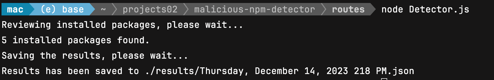

# 
# Malicious Node Package Detector
## Version 1.0

<table>
    <tr>
        <td>
          <a href="https://github.com/eapostol/malicious-node-package-checker.git">Malicious Node Package Detector</a>
        </td>
    </tr>
</table>


## What does this do?
Malicious Node Package Detector is a tool that helps you to detect malicious node packages in your node project. It scans your project and checks for malicious packages. It also checks for the version of the packages and if the version is outdated, it will notify you to update the package.

## What are the Requirements?
- Node.js
- NPM
- Git
- Internet Connection


## How do I install it?

1. Clone the repository into a folder of your choice.
2. Navigate to the folder and run `npm install` to install the dependencies.
3. Run `node ./routes/Detector.js` to run the program directly from the terminal.

```bash
npm i
node ./routes/Detector.js
```

### What does it look like in action?




A report, if results are found, will be written inside the results folder. The report will be in the form of a JSON file.


What you really need to do right now is just copy Detector.js from inside this project into your NodeJS application, and ensure that you have a folder called results in your project directory adjacent to the results folder. This is where the report will be written to. Finally, run the Detector.js file from the command line.

```bash
node ./{your project dir}/Detector.js
```

And it should review the contents of your node_modules folder.

### What's Next?

* Plan to output the results to a web page running off a local express server. This is why there is an entire Express server and routes in the project. I just haven't gotten around to it yet.

### Development
Want to contribute? Great!

To fix a bug or enhance an existing module, follow these steps:

- Fork the repo
- Create a new branch (`git checkout -b improve-feature`)
- Make the appropriate changes in the files
- Add changes to reflect the changes made
- Commit your changes (`git commit -am 'Improve feature'`)
- Push to the branch (`git push origin improve-feature`)
- Create a Pull Request

### Bug / Feature Request

If you find a bug (the applicatio couldn't handle the query and / or gave undesired results), kindly open an issue [here](https://github.com/eapostol/malicious-node-package-checker/issues/new) by including your search query and the expected result.

If you'd like to request a new function, feel free to do so by opening an issue [here](https://github.com/eapostol/malicious-node-package-checker/issues). Please include sample queries and their corresponding results.


## [License](./LICENSE.md)

MIT License for the time being. Just give me credit if you use my code somewhere else.

